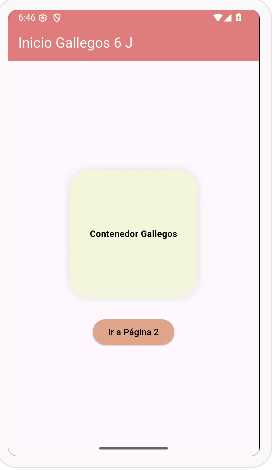
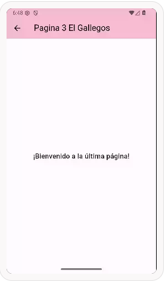

# Navegacion entre paginas con Flutter
# Ailin Gallegos Gpo 6J
# mi prompt o preguntas AI

Lenguaje Dart Flutter, Nivel principiante, navegación entre 3 paginas utilizando rutas nombradas, desde main llamar a la pagina1, en la pagina en appbar mostrar el texto "inicio Gallegos 6 J" en color blanco, color de fondo cafe, iconos blancos, en body un contenedor redondeado color beige 200 por 200 con texto negro y centrado, y un boton de color amarillo texto negro para seleccionar pagina 2, en la pagina 2 un appbar con texto "Segunda pagina 6 J" en color rojo, fondo negro y los iconos en blanco, en body una imagen desde la red y un boton para avanzar a la pagina 3, en la pagina 3 en appbar un texto color negro "pagina 3 El Gallegos", color de fondo rosa claro, todo en un solo archivo, elegante y atractivo

## pantallas en web

## pantallas en android

